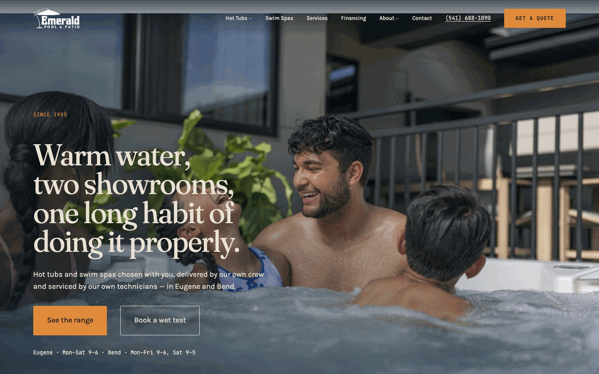
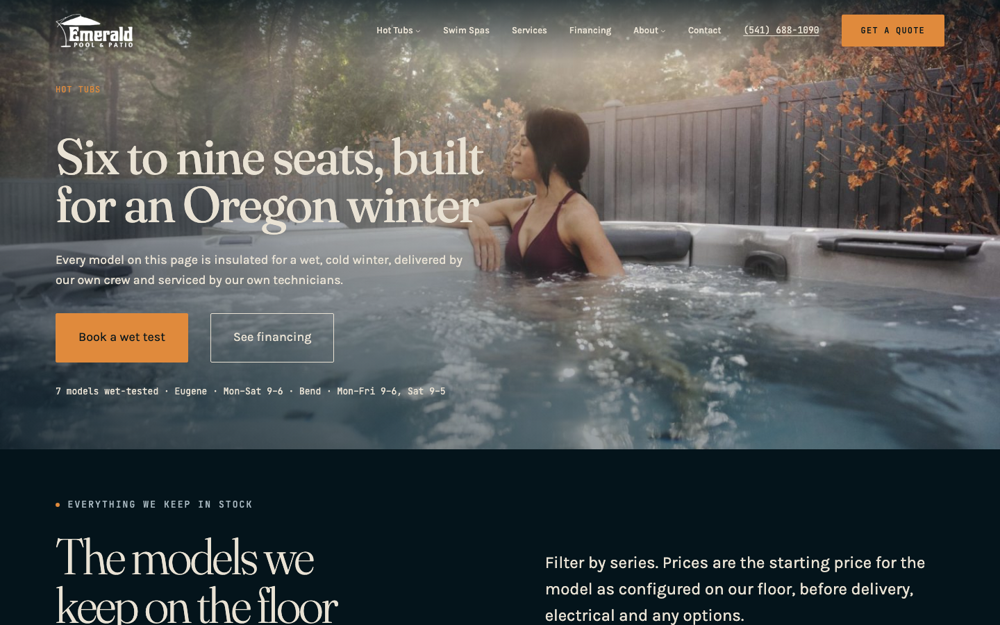
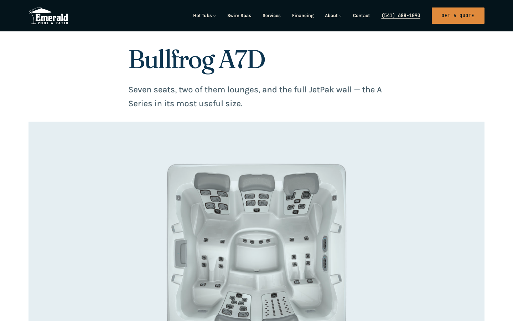
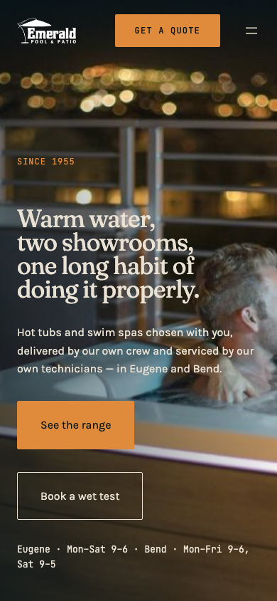
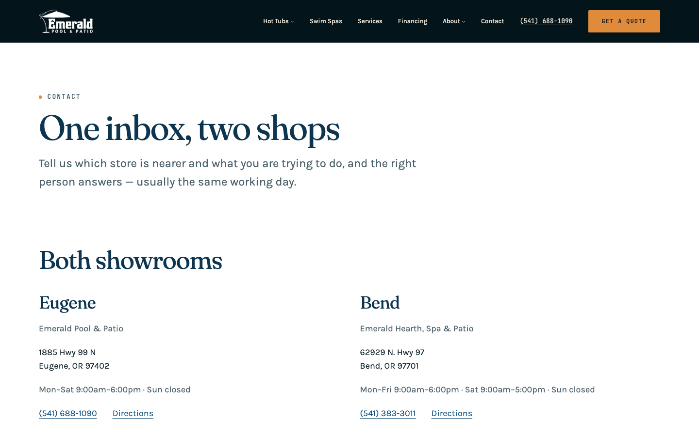

# Emerald Pool — what was delivered

A complete WordPress block site for Emerald Pool & Patio, running locally from three commands, and
underneath it a reusable system that the next client can be built on without editing a template or a
block. Emerald Pool is the first brand configured on that system, not the reason it exists.



## The reusable part

Everything ships as two pieces under one namespace. `zngiron-blocks` is a plugin that owns *what a
section is*: the content model, the brand data and twelve server-rendered blocks. `zngiron-base` is a
block theme that owns *what a section looks like*: presets, templates, parts and patterns. Neither
knows the client's name.

The brand lives in two files. `theme.json` holds every design decision that can be a preset — the
palette, three self-hosted families, the fluid type scale, six spacing steps, the layout widths.
`config/brand.json` holds the knowledge — post types, taxonomies and their terms, the meta fields,
the showroom records, the social links. Blocks never read a preset directly and never contain a raw
value; they read `--z-*` aliases, and one stylesheet binds those aliases to theme.json presets.

That separation is what makes a rebrand a data job. A second client is a new `brand.json`, a new
palette, new fonts and new photographs. Adding a spec field is one entry in `brand.json`, and it
appears in the Specs Table, in the Compare Table, on the card strip and in the Product JSON-LD,
because all four read the same array.

## The sizing contract is the proof

The claim a templating system has to survive is that someone else's photographs drop in without
being retouched. This build holds that with six rules applied everywhere: `contentSize` 720 and
`wideSize` 1280 plus full bleed; root padding 24px stepping to 48px at 1024px; a section is one
full-bleed Group with a constrained inner layout; media is always a Frame with a fixed aspect ratio
drawn from a set of five; a hero is `100svh`, `75svh` or `50svh` less the admin bar; a grid is CSS
grid with equal-height cards. An image never sets the height of a layout — the ratio does, and
`object-fit` with an editable focal point decides what happens inside it.

Two consequences are worth knowing. `box-sizing: border-box` is load-bearing: without it a hero
asking for a viewport renders a viewport plus its own padding. And manufacturer plan renders are not
photographs — they are line drawings on white, so they are contained on the paper ground and drawn
to one scale rather than cropped to fill a frame.



## Blocks and content

Twelve blocks, all `apiVersion: 3`, all server-rendered from `render.php` so the editor preview and
the front end come from one template. Three of them are interactive — the post grid's series filter,
the testimonial slider and the counting stats — and all three use the Interactivity API. There is no
jQuery on any page. The full inventory, with attributes, is in `docs/BLOCKS.md`; the folder map, the
token aliases and the rebrand procedure are in `docs/ARCHITECTURE.md`.

The seed builds the demo: ten spa models with real scraped specifications, eleven pages of block
markup, three journal posts, the navigation and both showroom records. It is idempotent — media
matches on a meta key and every post on its slug — so running it twice changes nothing, which is
what makes it usable as a CI smoke test.



## Verification

Three commands run against the running site, and all three are green.

`make shots` takes viewport screenshots at 1:1 — never full-page, because scaling a page into one
image hides exactly the defects that matter — at six widths (390, 768, 1024, 1440, 1920, 2560), four
scroll positions, with the off-canvas navigation opened below 1080px. At every stop it asserts seven
things: no horizontal overflow, nothing left part-faded, header text clearing 4.5:1 in both of its
states, no clipped button label, one navigation row at desktop widths and the toggle below, a
full-height hero exactly one viewport ±2px, and no console errors. The current run is **clean across
241 stops**.

`make crawl` walks every internal link and image once: **206 URLs, 0 broken, 0 `#` placeholders**.
`make axe` runs axe-core's colour-contrast rule over every page at 1440 and 390, at the top and
scrolled, so both header states are measured: **0 violations across 14 pages × 2 widths × 2 scroll
positions**. The seed runs with no PHP notices.

Home page weight, uncompressed: 38 KB of CSS, 112 KB of JavaScript — almost all of it the
Interactivity API runtime the three interactive blocks share — and no jQuery, against the live
site's single 610 KB stylesheet and two jQuery copies.



## Running it

```sh
cp .env.example .env
make up        # wordpress + mariadb
make install   # core install, activate zngiron-base and zngiron-blocks, permalinks
make seed      # media, spas, pages, journal, navigation
```

Then http://localhost:8080, admin `admin` / `admin`. Nothing on the host needs PHP, MySQL or wp-cli;
`build/` is committed, so a deploy never needs a Node toolchain. `make shots` needs Node and
Playwright on the host, `make crawl` and `make axe` need Python.

## To rebrand

Four files, in this order: `theme.json` for the palette, fonts, type scale and spacing;
`config/brand.json` for the name, the content model, the meta fields and the locations;
`assets/` for the three `.woff2` files, the logo, the favicon and the pattern photographs; and
`seed/` if the new site wants demo content at all. Nothing else names a client — there is no client
string in a template, a part, a block or a stylesheet.

## What production would need next

**A mailer behind the contact form.** The form is real, labelled, accessible markup with no handler.
Production wants a POST endpoint, server-side validation, a spam control that is not a visible
honeypot, transactional delivery through Postmark or SES, and a stored copy so a lost email is not a
lost lead.

**A decision on commerce.** The business does not transact online, and WooCommerce on the live site
is pure overhead — its cart, checkout and account pages are indexable and lead nowhere. If commerce
is wanted later, the `spa` post type maps onto Woo products cleanly: spec meta becomes product
attributes, `spa_series` becomes a product category, and Post Grid swaps its query while the card
markup stays. If it is not wanted, Woo should go and those pages should 410.

**Rewrite rules for the audited URLs.** This build ships `/spas/<model>/`; the audit proposed
`/hot-tubs/<model>/`. That is a `spa_type`-aware rewrite plus a canonical redirect, deferred because
the larger piece of work is the redirect map from 4,090 existing `/models/detail/?unit_id=N` URLs.

**Footage, and its licensing.** A hover-video treatment on the catalogue cards was scoped and cut.
emeraldpool.com has no per-model clip to mirror — what looks like one there is a handful of
always-looping Vimeo backgrounds on category tiles. Real per-model footage is a content decision, and
re-hosting a manufacturer's marketing video is a licensing decision. Both belong with the client.

**CI.** PHPCS with the WordPress ruleset, `@wordpress/scripts` lint for JS and CSS, a block build on
every push with the compiled output diffed against the commit, and a smoke test that installs
WordPress and runs the seed twice asserting the counts are unchanged. Then the production hygiene the
current site lacks: object caching, a CDN, an image pipeline shipping AVIF/WebP at the sizes the
cards request, a staging environment, and `make axe` and `make shots` running on every push so the
floor this build sets does not quietly drop.


